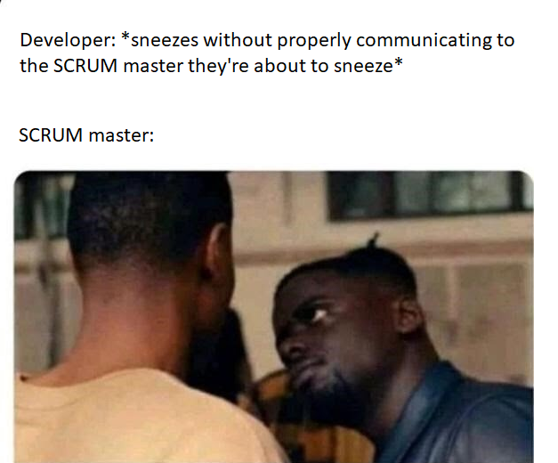
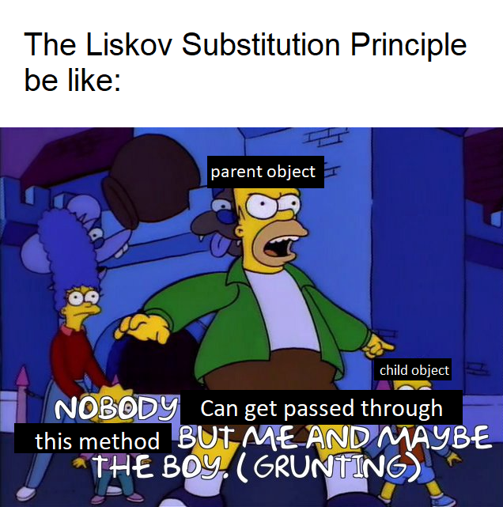
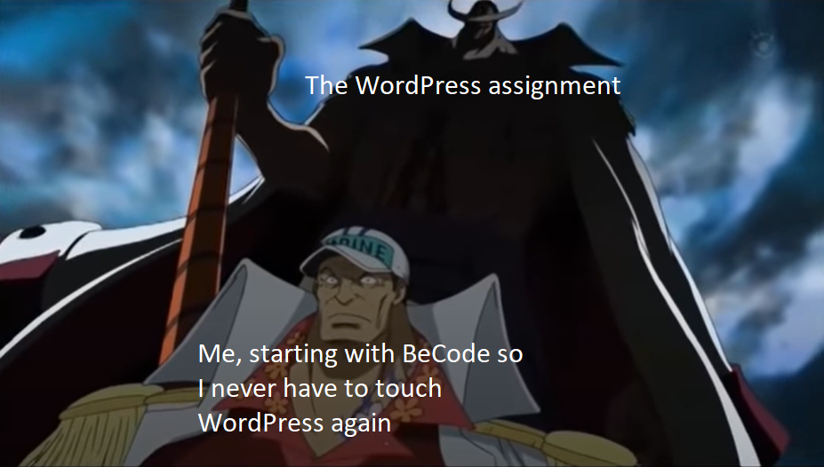
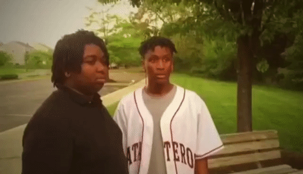

## Hello there :wave:
<!-- General Kenobi -->

My name is Besart Elezi, and I just want to start off this README with some essential information and some fun facts about me!

* I'm currently in training at BeCode to become a Fullstack Developer <!-- , and I'm currently looking for an internship -->
* Thanks to my background in Marketing, I can write some spicy READMES
* Making memes is a passion of mine, especially memes about coding
* Some of my hobbies are: Watching anime, reading manga/books, playing videogames, drawing, and writing
  * So basically, if it's geeky, chances are that I love it
* The quote that has stuck with me the most comes from the anime Hajime no Ippo and it goes as follows:
  * “Not everyone who works hard is rewarded. But! All those who succeed have worked hard!” - Kamogawa Genji
* Did I already mention that I **really** like making memes?

Here you can find my GitHub stats!
I really like this functionality because it makes me feel more like a videogame character.

## "I was told there would be memes?"
And whoever told you that wasn't lying!
This might sound strange, but making memes really helps me learn to be better at coding.

If I can create a meme about something, like the MVC structure or the OOP principles, then I first need to have a SOLID understanding of that concept.
And because I need to explain the concept in a simple and fun way, it again helps me understand the concept that much better.

Here are some of the memes I made:

## Bye there :wave:
<!-- That's not how the quote goes General Kenobi -->

With that out of the way, I hope you have a lot of fun browsing through my GitHub.
And if you didn't have a lot of fun, then for my pride and fragile ego's sake, just pretend you did have fun!
My job here is done now, so peace out!

